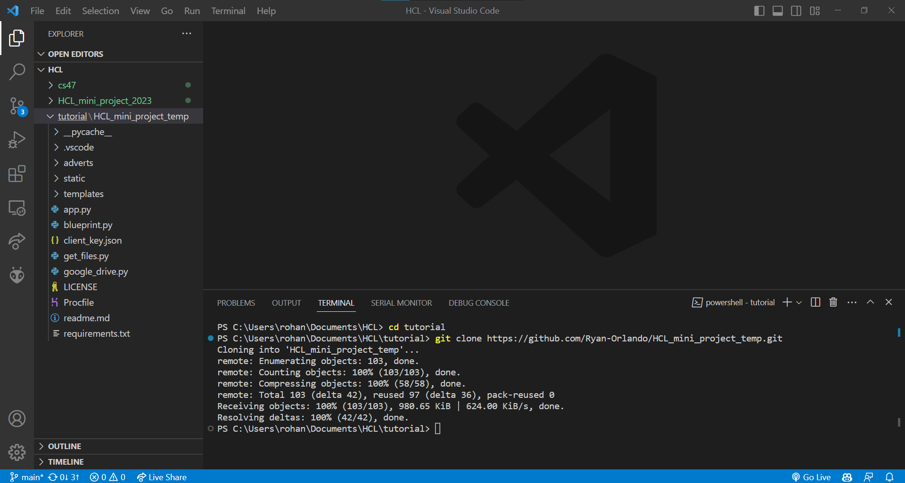

# HCL mini-project summer internship 2023

## General info:
Name: Ryan A.
Roll No: CS20B1094
Project: Advertisment Managment System
Aim: Making Back-End API server which return image on REST API norms

## How to run this project locally:
I will be explaining step by step to run this project locally

<br>

### Clone/Copy this repository locally - Must have `git`
<br>

Open up any terminal in our required directory


Run this script:
```sh
git clone https://github.com/Ryan-Orlando/HCL_mini_project_temp.git
```


<br>

### Move into the project folder
<br>
Run this script:

```sh
cd HCL_mini_project_temp
```

<br>

### Installing nesscary packages - Must have `pip`
<br>
Run the following script:

```sh
pip install -r requirements.txt
```


<br>

### Run the project
<br>
Run the script:

```sh
python app.py
```


<br>

### Follow the local-hosted link in your preferred browser
<br>


### Done hosting the project locally
- Note you can upload files locally (bascially copying the image files into the `adverts` folder)
- Downside is that it is only useful for applications within your system
